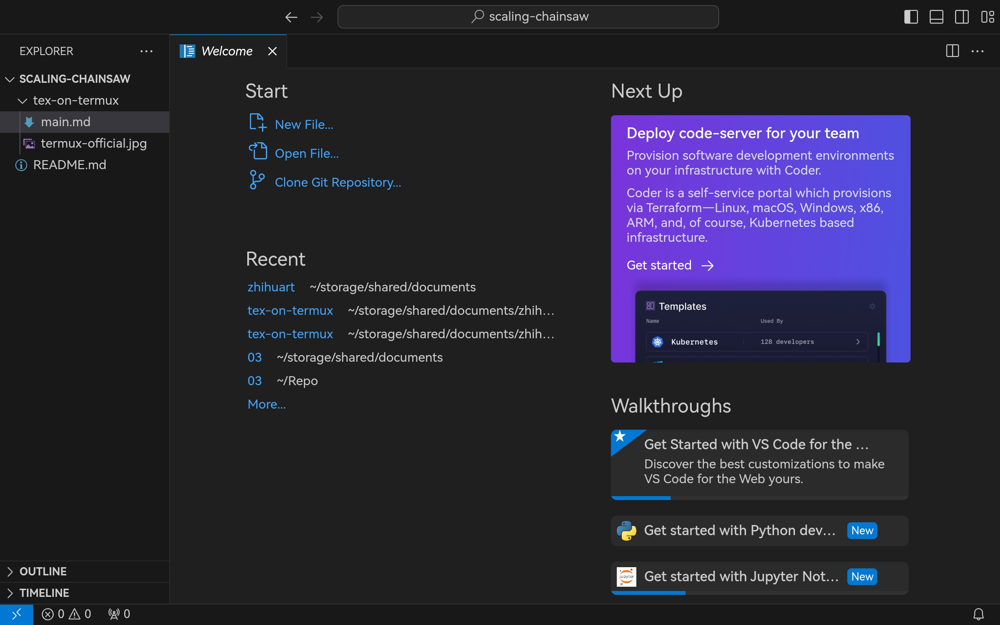

# tex on termux：使用 termux 配置 vscode 写 tex

> 当然，首先你要有一个屏幕足够大的设备（或者足够好的裸眼视力）以及一个足够舒服的蓝牙键盘（或者屏幕足够大的设备）。

## Termux & Code Server

经常玩 linux 的同学们都知道，shell 是 linux 中地位特殊的东西，在大多数发行版上，linux 自带的 shell 都是 bash 或者 zsh，而在 Android 下默认是没有这个 shell 应用的。尽管可以通过 adb 以远程连接的方式借别的 shell 访问 Android，这对于想要把 Android 当作 laptop 替代品的我们来说总不是那么方便——于是我们需要一个现代化的、足够好用的 shell，以及一堆配套设施——此时我们很自然会想到 termux。

我们可以先从 [termux官网](https://termux.dev/en/) 获取 termux，（最好一并装上 termux-API）。


显然，我们需要通过常规的 apk 安装方式来安装 termux （意思就是直接装），以及 termux-api。

完成这一步之后，我们就可以打开可爱的 termux 了。

然后执行

```bash
pkg install code-server
```

这条命令是不言自明的。（如果不是，很可能你不是这篇文章的目标读者）

> 值得一提的是，此处 termux 会建议你选一个比较近的服务器：


在一切没有意外的情况下，经过漫长的等待，我们可以跑 `code-server` 了！

随手开个浏览器访问 `localhost:8080` 看看吧。



> 因为此处我已经在编辑，所以直接打开了用过的文件夹。

## Python

现在回到 termux，用 `Ctrl+C` 把 `code-server` 先干掉，然后装 `python`。

```bash
pkg install python
pkg install python-pip
pkg install python-numpy
pkg install matplotlib
```

## Code Server Plugins

> 接下来就是正题

code-server 并非完全是 vscode，而是基于 vscode 的开源部分发展而成的服务端 code，它具有自己的插件仓库，和 code 的微软官方插件仓库并不相通。

退一步来说，即使直接安装 vscode 的插件，相当一部分插件将不会完全正常运行，因为许多插件依赖非平台独立的代码（别忘了你的移动设备的 cpu 是 aarch64）但我们仍然需要 vscode 的一部分插件，比如说 `LaTeX Workshop`，比如说 `Jupyter Notebook`，其中后者在 termux 下是有完整适配的。

对于能直接在 code-server 插件仓库找到的插件，基本上可以认为是已经适配好了的，我们不妨直接上手：

> 建议安装 `Python` 和一堆 `Jupyter`。
